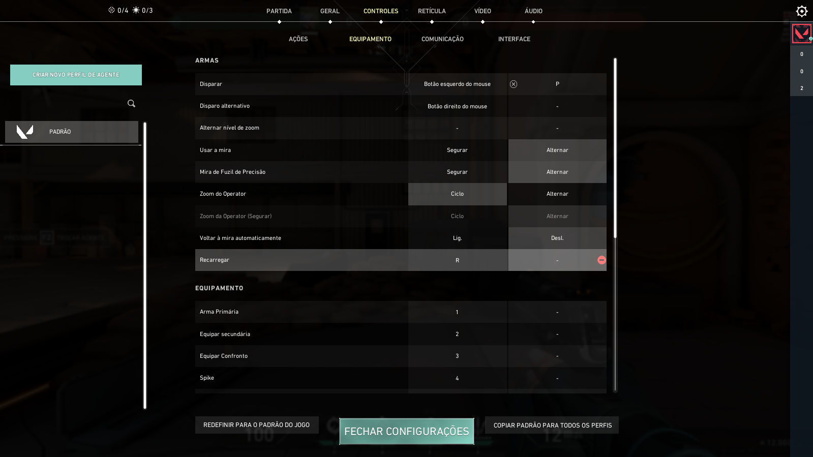

# VALORANT CHEAT 
**Assistência interna não detectada** usando exploit recém-descoberto.
Apesar de ser injetada internamente, essa ferramenta não interage com os endereços e memórias do jogo, operando de maneira 100% independente da memória.

Este tutorial apresenta um script avançado projetado para jogos de tiro em primeira pessoa, especialmente adaptado para uso em títulos como Valorant. O script é baseado em detecção de cores para reconhecer automaticamente estruturas inimigas, que são destacadas por contornos em tons roxos. O que é impressionante sobre este projeto, não é o cheat, MAS a GUI, a GUI é feita com ImGui e cobre honestamente todos os recursos que a maioria das GUIs para cheats possui, contando com um overlay injetado internamente de forma indetectável e outra funções como teclas de atalho automáticas para mapeamento de código de chave virtual, um sistema de configuração e um lindo FOV LGBTQIA+.
  
 

O script avançado calcula a localização dos alvos, ajusta o campo de visão (FOV) e coordena ações do mouse automaticamente. Utilizando threading para gerenciar a entrada do teclado e encerramento do script, ele opera continuamente sem interrupções. Importante destacar que, como um script 100% externo que não realiza leitura ou escrita na memória do jogo, ele se baseia exclusivamente na detecção de cores para funcionar. Por esse motivo, não há riscos de detecção pelos sistemas anti-cheat, que geralmente monitoram alterações diretas na memória dos jogos.

O tutorial termina com uma demonstração e orientações sobre como realizar a configuração inicial do RubiAIM V2 antes de colocá-lo em funcionamento. O código do script está disponível para venda; por favor, envie-me uma mensagem para obter mais informações.
 
# Como configurar:
- Certifique-se de ajustar o contorno do inimigo para roxo e configurar seu jogo para o modo janela sem bordas.
1) Acesse as configurações do jogo e procure por opções como "Teclado" ou "Atalhos de teclado".
2) Localize a função "Disparar/Atirar":
    - A tecla principal padrão é o botão esquerdo do mouse.
    - A tecla secundária não está atribuída (vincule-a à tecla 'P').
    - 
 
3) Retorne ao software e clique em ‘Ativar’ uma vez, e seu script de assistência avançado será ativado.
