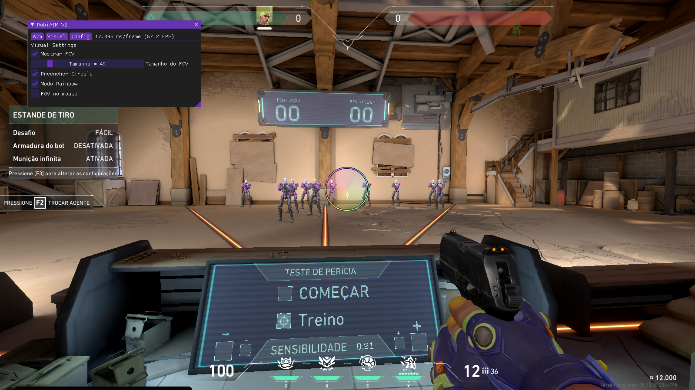

# VALORANT  
**AIM interno não detectado** cheat usando exploit recém-descoberto.  
Apesar de ser injetado internamente, isso não vai mexer com os endereços e memórias do jogo, é 100% independente da memória.  
  
Personalizável através do menu.  
- A tecla de abertura é 'Insert', pressione-a para abrir o cheat.
  
 

[VIDEO TUTORIAL](https://streamable.com/g2tdsr)
 
# INFO    
- Altere o nível do AIM se estiver puxando mal.  
O atraso padrão é 40 - 100 (Min - Max)       
Selecione uma 'Keybind' e adicione dentro do Valorant como uma tecla de atirar secundária.   
1) Nas configurações do jogo, encontre algo como Teclado ou Atalhos de teclado. 
2) Encontre a opção Disparar/Atirar:
    - por padrão a tecla principal é o botão esquerdo do mouse
    - o secundário não está atribuído (vincule-o a tecla 'P').
3) Volte ao software e clique uma vez em ‘Ativar AIM’ e seu AIM estará ativo.
